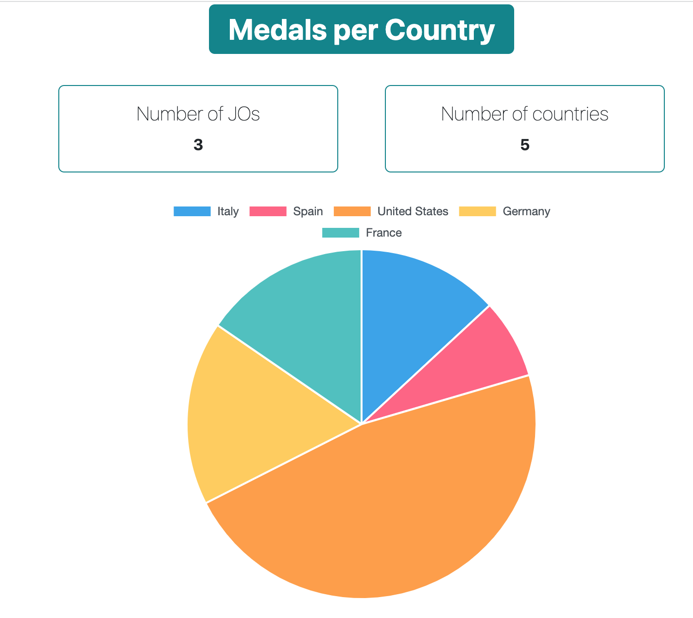
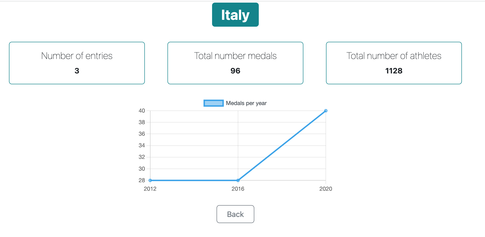

# OlympicGamesStarter

This project was generated with [Angular CLI](https://github.com/angular/angular-cli) version 14.1.3.

Don't forget to install your node_modules before starting (`npm install`).

## Tooling
The project uses the following tech stack : 
- Angular 14.2.3
- Chart.js v4.2.1 (https://www.chartjs.org/)
- Bootstrap v5.2.3 (https://getbootstrap.com/docs/5.2/getting-started/introduction/)

## Sceenshots

